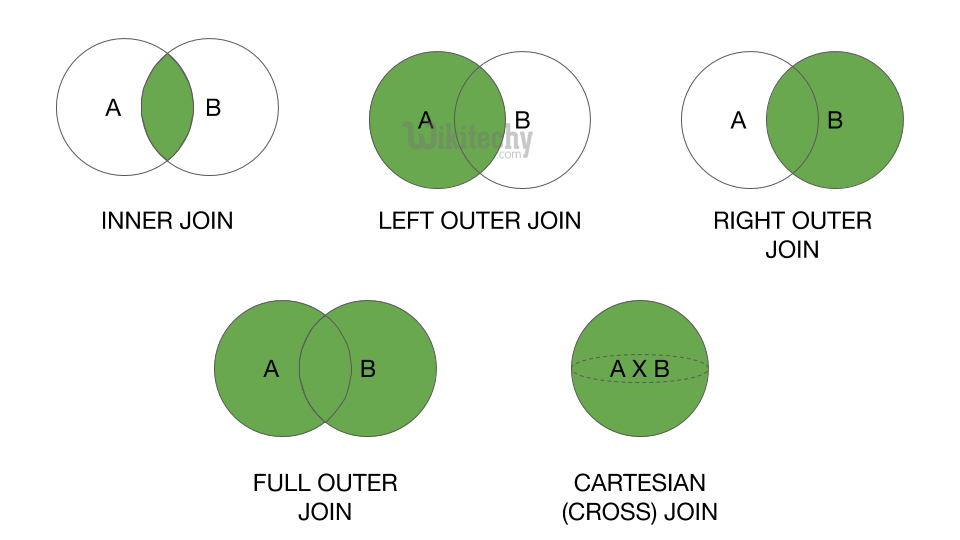

# SQL JOIN에 대한 간단한 설명

> ## 1. NATURAL JOIN(두 테이블 간 동일컬럼 모두 ON),
>
> ## 2. CROSS JOIN(카티션 프로덕트, 데카르트곱),
>
> ## 3. SELF JOIN(동일 테이블 간 JOIN, 차상위 등 구할 때)
>
> ## 위 세 가지는 아래 설명에서는 생략한다.



```sql
SELECT *
  FROM SCOTT.DEPT;
```

| DEPTNO | DNAME      | LOC      |
| :----- | :--------- | :------- |
| 10     | ACCOUNTING | NEW YORK |
| 20     | RESEARCH   | DALLAS   |
| 30     | SALES      | CHICAGO  |
| 40     | OPERATIONS | BOSTON   |

```sql
SELECT *
  FROM SCOTT.EMP;
```

| EMPNO | ENAME  | JOB       | MGR  | HIREDATE   | SAL     | COMM    | DEPTNO |
| :---- | :----- | :-------- | :--- | :--------- | :------ | :------ | :----- |
| 7499  | ALLEN  | SALESMAN  | 7698 | 1981-02-20 | 1600.00 | 300.00  | 30     |
| 7521  | WARD   | SALESMAN  | 7698 | 1981-02-22 | 1250.00 | 500.00  | 30     |
| 7566  | JONES  | MANAGER   | 7839 | 1981-04-02 | 2975.00 |         | 20     |
| 7654  | MARTIN | SALESMAN  | 7698 | 1981-09-28 | 1250.00 | 1400.00 | 30     |
| 7698  | BLAKE  | MANAGER   | 7839 | 1981-05-01 | 2850.00 |         | 30     |
| 7782  | CLARK  | MANAGER   | 7839 | 1981-06-09 | 2450.00 |         | 10     |
| 7788  | SCOTT  | ANALYST   | 7566 | 1987-04-19 | 3000.00 |         | 20     |
| 7839  | KING   | PRESIDENT |      | 1981-11-17 | 5000.00 |         | 10     |
| 7844  | TURNER | SALESMAN  | 7698 | 1981-09-08 | 1500.00 | 0.00    | 30     |
| 7876  | ADAMS  | CLERK     | 7788 | 1987-05-23 | 1100.00 |         | 20     |
| 7900  | JAMES  | CLERK     | 7698 | 1981-12-03 | 950.00  |         | 30     |
| 7902  | FORD   | ANALYST   | 7566 | 1981-12-03 | 3000.00 |         | 20     |
| 7934  | MILLER | CLERK     | 7782 | 1982-01-23 | 1300.00 |         | 10     |

### INNER JOIN

```sql
/*
EMP 테이블에서 부서가 SALES인 사람의 이름만 조회하고 싶다.

EMP 테이블에는 부서번호(DEPTNO)만 존재하고 부서명(DNAME)이 없기 때문에
DEPT 테이블에서 해당 정보를 가져와야 한다.

이처럼 서로 분산되어 있는 정보를 하나로 엮고 싶을 때 사용하는 것이 테이블 JOIN이다.

이때, 어떤 기준으로 각 레코드(row)를 합칠 것인가를 결정하려면
JOIN KEY를 정해야 하는데 DEPT 테이블과 관계가 있는 컬럼은 DEPTNO(FOREIGN KEY)이다.
*/
SELECT EMP.ENAME
  FROM SCOTT.EMP
  INNER JOIN SCOTT.DEPT
  ON EMP.DEPTNO = DEPT.DEPTNO
 WHERE DEPT.DNAME = 'SALES';
```

| ENAME  |
| :----- |
| ALLEN  |
| TURNER |
| JAMES  |
| WARD   |
| MARTIN |
| BLAKE  |

예를 들어 DEPT에서 40번에 해당하는 부서(OPERATIONS)는 존재하지만, EMP 테이블에는 존재하지 않는다.

= 문서 상으로 존재하는 부서이나 실제 소속된 사원은 없는 부서라고 보면 된다.

이럴 경우 INNER JOIN은 두 테이블 모두에 해당 데이터가 존재해야 하므로, 아무 것도 가져오지 않는다.

그러나 LEFT/OUTER OUTER JOIN을 사용할 경우 어느 한 테이블에 해당하는 정보가 없더라도,
나머지 하나의 테이블에서는 정보를 가져오겠다. 라는 뜻이다.

```sql
-- INNER JOIN : EMP 테이블에는 OPERATIONS 에 소속된 사원이 없기 때문에 데이터가 출력되지 않는다.
SELECT DEPT.DEPTNO
     , DEPT.DNAME
     , DEPT.LOC
     , EMP.EMPNO
     , EMP.ENAME
     , EMP.JOB
     , EMP.MGR
     , EMP.HIREDATE
     , EMP.SAL
     , EMP.COMM
     , EMP.DEPTNO
  FROM SCOTT.EMP
  INNER JOIN SCOTT.DEPT
  ON EMP.DEPTNO = DEPT.DEPTNO
 WHERE DEPT.DNAME = 'OPERATIONS';
```

| DEPT.DEPTNO | DNAME | LOC | EMPNO | ENAME | JOB | MGR | HIREDATE | SAL | COMM | EMP.DEPTNO |
| :---------- | :---- | :-- | :---- | :---- | :-- | :-- | :------- | :-- | :--- | :--------- |
|             |       |     |       |       |     |     |          |     |      |            |

### LEFT OUTER JOIN

```sql
/*
LEFT OUTER JOIN : EMP 테이블에는 OPERATIONS 에 소속된 사원이 없지만, DEPT 테이블에는 있기 때문에 DEPT 테이블에
해당하는 데이터는 출력이 된다. "DEPT" LEFT OUTER JOIN "EMP" 이기 때문에 기준은 DEPT 테이블이다.
= DEPT에 데이터가 있으면, EMP에 없더라도 출력해라
*/
SELECT DEPT.DEPTNO
     , DEPT.DNAME
     , DEPT.LOC
     , EMP.EMPNO
     , EMP.ENAME
     , EMP.JOB
     , EMP.MGR
     , EMP.HIREDATE
     , EMP.SAL
     , EMP.COMM
     , EMP.DEPTNO
  FROM SCOTT.DEPT
  LEFT OUTER JOIN SCOTT.EMP
  ON EMP.DEPTNO = DEPT.DEPTNO
 WHERE DEPT.DNAME = 'OPERATIONS';
```

| DEPT.DEPTNO | DNAME      | LOC    | EMPNO | ENAME | JOB  | MGR  | HIREDATE | SAL  | COMM | EMP.DEPTNO |
| :---------- | :--------- | :----- | :---- | :---- | :--- | :--- | :------- | :--- | :--- | :--------- |
| 40          | OPERATIONS | BOSTON | NULL  | NULL  | NULL | NULL | NULL     | NULL | NULL | NULL       |

### RIGHT OUTER JOIN

```sql
/*
반대로, "DEPT" RIGHT OUTER JOIN "EMP" 이기 때문에 기준은 EMP 테이블이다.
= DEPT 테이블에 데이터가 없더라도, EMP에 있으면 출력해라. 하지만 없었죠?
*/
SELECT DEPT.DEPTNO
     , DEPT.DNAME
     , DEPT.LOC
     , EMP.EMPNO
     , EMP.ENAME
     , EMP.JOB
     , EMP.MGR
     , EMP.HIREDATE
     , EMP.SAL
     , EMP.COMM
     , EMP.DEPTNO
  FROM SCOTT.DEPT
  RIGHT OUTER JOIN SCOTT.EMP
  ON EMP.DEPTNO = DEPT.DEPTNO
 WHERE DEPT.DNAME = 'OPERATIONS';
```

| DEPT.DEPTNO | DNAME | LOC | EMPNO | ENAME | JOB | MGR | HIREDATE | SAL | COMM | EMP.DEPTNO |
| :---------- | :---- | :-- | :---- | :---- | :-- | :-- | :------- | :-- | :--- | :--------- |
|             |       |     |       |       |     |     |          |     |      |            |

### FULL OUTER JOIN

```sql
/*
FULL OUTER JOIN : 두 테이블 중 어느 한쪽에라도 데이터가 있으면 출력해라.
*/
SELECT DEPT.DEPTNO
     , DEPT.DNAME
     , DEPT.LOC
     , EMP.EMPNO
     , EMP.ENAME
     , EMP.JOB
     , EMP.MGR
     , EMP.HIREDATE
     , EMP.SAL
     , EMP.COMM
     , EMP.DEPTNO
  FROM SCOTT.DEPT
  FULL OUTER JOIN SCOTT.EMP
  ON EMP.DEPTNO = DEPT.DEPTNO
 WHERE DEPT.DNAME = 'OPERATIONS';
```

| DEPT.DEPTNO | DNAME      | LOC    | EMPNO | ENAME | JOB  | MGR  | HIREDATE | SAL  | COMM | EMP.DEPTNO |
| :---------- | :--------- | :----- | :---- | :---- | :--- | :--- | :------- | :--- | :--- | :--------- |
| 40          | OPERATIONS | BOSTON | NULL  | NULL  | NULL | NULL | NULL     | NULL | NULL | NULL       |

### USING

```sql
/*
USING : JOIN 시 컬럼명이 같을 경우 ON절 대신 USING을 사용할 수 있다.
이때 USING절에 사용되는 컬럼은 앞에 스키마.컬럼명 형태가 아닌 그냥 컬럼명만 사용
그러나 보통 컬럼명이 다른 경우가 대부분이므로 잘 사용하지 않는다.
 */
SELECT DEPTNO
     , DEPT.DNAME
     , DEPT.LOC
     , EMP.EMPNO
     , EMP.ENAME
     , EMP.JOB
     , EMP.MGR
     , EMP.HIREDATE
     , EMP.SAL
     , EMP.COMM
  FROM SCOTT.DEPT
  LEFT OUTER JOIN SCOTT.EMP
  USING ( DEPTNO )
 WHERE DEPT.DNAME = 'OPERATIONS';
```

| DEPT.DEPTNO | DNAME      | LOC    | EMPNO | ENAME | JOB  | MGR  | HIREDATE | SAL  | COMM | EMP.DEPTNO |
| :---------- | :--------- | :----- | :---- | :---- | :--- | :--- | :------- | :--- | :--- | :--------- |
| 40          | OPERATIONS | BOSTON | NULL  | NULL  | NULL | NULL | NULL     | NULL | NULL | NULL       |
